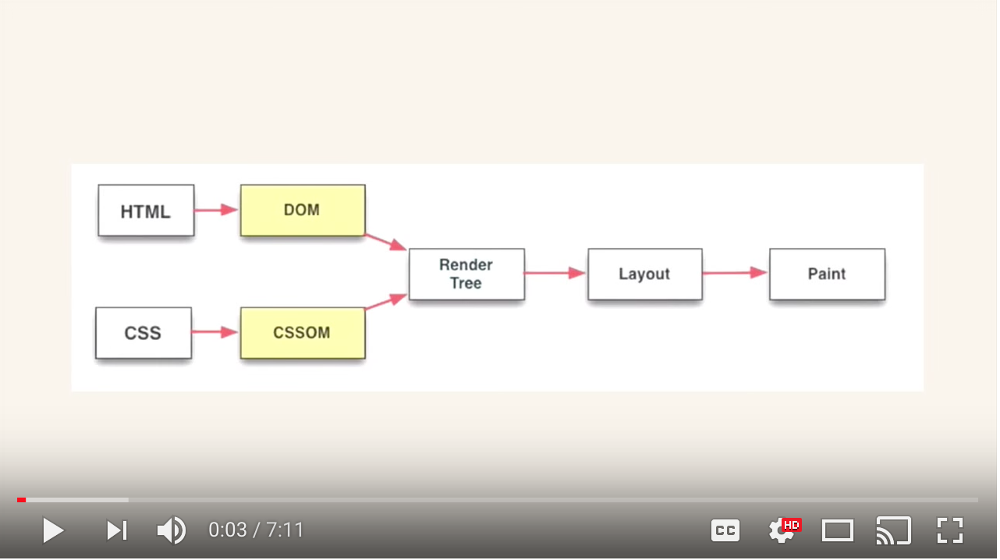

# Goals of the session


## Understanding how digital (text) content is stored and processed 


## Knowledge of basic characteristics of markup languages

- Descriptive Markup
- Difference of text and markup


## Basic knowledge about text encoding

- How is text translated into bytes?
- Unicode


## Knowledge of basics of markup processing

- What is parsing?
- Document Object Model


---

# Descriptive Markup

## Essentials

- Digital content is mostly stored as marked up text.
- The grammar of the markup is standardized.
- The standardized markup is the base of the processing of the text by software.
- How software processes the text depends largely on the quality of the markup.

## Markup before the digital age

> The idea and terminology evolved from the "marking up" of paper manuscripts, i.e., the revision instructions by editors, traditionally written with a blue pencil on authors' manuscripts.

[Markup language - Wikipedia](https://en.wikipedia.org/wiki/Markup_language)

---


Source: [Markup is](https://www.ncbi.nlm.nih.gov/staff/beck/xml/markup/I-A.html)

---


~~~ { .html }

<!DOCTYPE html>

<html>

    <head>

        <title>Sample Manuscripts</title>

        <style type="text/css">

        h1 {font-family: Helvetica, sans-serif; font-size: 16}

        p {font-family: Times-Roman, serif; font-size: 16}

        </style>

    </head>

    <body>

        <h1>Sample Manuscripts throughout the Ages</h1>

        <p>The funny thing about sample manuscripts is that they never say anything really interesting.</p>

    </body>

</html>

~~~


--- 


## Procedural vs. descriptive markup

- Control of defined applications by **procedural markup**: Defines the state of processing applications
- **Descriptive markup**: Describes text and leaves the processing to the application


## Example PCL


```

Ec(s0Saufrechter Text Ec(s1Skursiv gesetzter Text

```


## How does a computer distinguish text and markup?

- Markup delimiters in HTML and XML: `<`, `>`, 
- Markup delimiters for Entities: `&`, `;`(referencing special characters, escaping the literal values of < and >
- Possible markup delimiters in SGML: `[`, `]`, `{`, `}`

---

# Encoding: Transforming text into bytes

---


Source: [Ascii Table - ASCII character codes and html, octal, hex and decimal chart conversion](http://www.asciitable.com/ "Ascii Table - ASCII character codes and html, octal, hex and decimal chart conversion")

---


Source: [Ascii Table - ASCII character codes and html, octal, hex and decimal chart conversion](http://www.asciitable.com/ "Ascii Table - ASCII character codes and html, octal, hex and decimal chart conversion")

---


Source: [How does unicode SMS Works? - Quora](https://www.quora.com/How-does-unicode-SMS-Works "(4) How does unicode SMS Works? - Quora")

---


---


# Parsing: How a computer reads text

---

Parsing (US: /ˈpɑːrsɪŋ/; UK: /ˈpɑːzɪŋ/), syntax analysis or syntactic analysis is the process of analysing a string of symbols, either in natural language or in computer languages, conforming to the rules of a formal grammar. The term parsing comes from Latin pars (orationis), meaning part (of speech).

[Parsing - Wikipedia](https://en.wikipedia.org/wiki/Parsing#cite_ref-1 "Parsing - Wikipedia")

--- 


Quelle: [The Developer's Digest - Spend your day here.: Parse XML with Java - SAX and DOM parser](http://codingbasics.blogspot.co.at/2011/01/parse-xml-with-java-sax-and-dom-parser.html "The Developer's Digest - Spend your day here.: Parse XML with Java - SAX and DOM parser")


# The DOM: A technical model for digital infomation

---


---

## Rendering of an HTML page


[](https://youtu.be/n1cKlKM3jYI)

